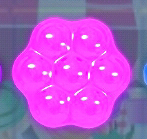

# 🍬 Candy Crush Clone

A Candy Crush-style match-3 game built with **C++** and **SFML (Simple and Fast Multimedia Library)**.

## 👥 Authors

- **Fatima Malik** — 23L-0826 | [github.com/fatimamalik2307](https://github.com/fatimamalik2307)  

## 🎮 About the Game

This is a clone of the popular Candy Crush game, developed as a project using C++ and the SFML graphics library. The player swaps adjacent candies to create matches of 3 or more in a row/column/diagonal to score points.

### Features
- 8×8 candy grid
- Candy swapping mechanic
- Match detection (horizontal, vertical, and diagonal)
- Score tracking
- Move counter (15 moves)
- Per-move countdown timer
- Shuffle board button
- Background music
- Animated start and exit screens

## 🛠️ Built With

- **Language**: C++
- **Library**: [SFML 2.x](https://www.sfml-dev.org/)
- **IDE**: Visual Studio

## 📁 Project Structure

```
/
├── 3.cpp              # Main game source file
├── dfg.cpp            # Additional source file
├── cc/                # Visual Studio solution folder
│   └── cc.sln
├── newfont.ttf        # Custom game font
├── newfontt.ttf       # Custom game font (alternate)
├── popsound.mp3       # Background music
├── popsound1.mp3      # Pop sound effect
├── openal32.dll       # OpenAL audio library
├── sfml-*.dll         # SFML runtime DLLs
└── [Images]           # Candy sprites and background assets
```

## 🚀 How to Run

### Prerequisites
- Windows OS
- Visual Studio (2019 or later recommended)
- SFML 2.x installed

### Steps
1. Clone the repository:
   ```bash
   git clone https://github.com/fatimamalik2307/candy-crush-clone.git
   ```
2. Open `cc/cc.sln` in Visual Studio.
3. Make sure SFML libraries are linked in the project properties.
4. Build and run the project (make sure all assets and DLLs are in the output directory).

## 📸 Screenshots



## 📂 Note on `.vs` Folder

The `.vs` folder is **not included** in this repository. It is a hidden Visual Studio folder containing local editor settings, caches, and user-specific preferences that are machine-specific and auto-generated. It will be recreated automatically when you open the project in Visual Studio.

## 📜 License

This project was created for educational purposes.
